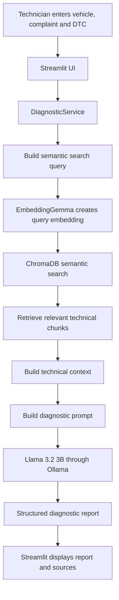

# 🚗 AutoDiag AI

### Automotive Diagnostic Copilot powered by Local LLM + RAG

AutoDiag AI is a domain-specific AI application that helps service advisors and technicians understand vehicle complaints faster. It retrieves relevant information from automotive technical documents and uses a local language model to generate a structured diagnostic report.

> **Important:** AutoDiag AI provides diagnostic guidance, not a confirmed diagnosis. All recommendations must be verified by a qualified technician using the applicable vehicle manufacturer's procedures.

---

## ✨ Why this project?

Automotive diagnosis often requires technicians to:

- Interpret customer complaints.
- Understand diagnostic trouble codes (DTCs).
- Search technical manuals.
- Compare possible causes.
- Decide which checks should be performed before replacing parts.

The information may already exist in manuals, but finding the right information quickly is difficult.

**AutoDiag AI solves this information-retrieval problem by combining semantic search with a local LLM.**

Instead of giving the model only a complaint, the application first retrieves relevant technical information and then asks the model to explain the case using that information.

---

## 🎯 Project objective

Build a lightweight, privacy-friendly automotive AI assistant that can:

1. Accept vehicle and complaint information.
2. Search an automotive technical knowledge base.
3. Retrieve the most relevant document sections.
4. Generate a structured diagnostic report.
5. Show the technical sources used by the AI.
6. Encourage testing and verification before parts replacement.

---

## 🧠 What is the main idea?

AutoDiag AI is **not a new AI model trained from scratch**.

It uses a pre-trained language model and adds automotive knowledge through **RAG**.

### RAG means Retrieval-Augmented Generation

```text
User complaint
      ↓
Convert complaint into an embedding
      ↓
Search the technical knowledge base
      ↓
Retrieve relevant document chunks
      ↓
Add those chunks to the LLM prompt
      ↓
Local LLM generates the report
      ↓
Display report and sources
```

### Simple explanation

Think of the system as a technician with a smart technical librarian:

- **Embedding model:** Finds information by meaning.
- **ChromaDB:** Stores and searches the knowledge.
- **LLM:** Reads the complaint and retrieved information, then explains the likely diagnostic path.
- **Streamlit:** Displays the complete experience in a browser.

---

## 🏗️ High-level architecture



---

## 🛠️ Technology stack

| Technology | Purpose |
|---|---|
| **Python** | Main programming language and application logic |
| **Streamlit** | Browser-based user interface |
| **Ollama** | Runs and exposes local AI models |
| **Llama 3.2 3B** | Generates the diagnostic response |
| **EmbeddingGemma** | Converts text into numerical embeddings |
| **ChromaDB** | Persistent vector database for semantic search |
| **pypdf** | Extracts text from PDF technical documents |
| **python-dotenv** | Loads environment-based configuration |

### Why a local model?

The project uses Ollama so the prototype can run locally without depending on a paid cloud LLM API. This is useful for:

- Learning and experimentation.
- Cost control during development.
- Keeping technical documents inside the local environment.
- Switching models through configuration.

The default configuration uses:

```text
LLM model:        llama3.2:3b
Embedding model:  embeddinggemma
Ollama host:      http://localhost:11434
```

---

## 📁 Project structure

```text
autodiag-ai-main/
│
├── app.py                         # Streamlit application and UI
├── requirements.txt               # Python dependencies
├── README.md                      # Project documentation
│
├── backend/
│   ├── __init__.py
│   ├── config.py                  # Environment variables and paths
│   ├── diagnostic.py              # Main diagnostic orchestration
│   ├── documents.py               # PDF extraction, cleaning and chunking
│   ├── embeddings.py              # Embedding generation through Ollama
│   ├── ingest_documents.py        # Backend ingestion utility
│   ├── llm.py                     # Ollama chat integration
│   ├── prompts.py                 # System prompt and diagnostic prompt
│   └── rag.py                     # ChromaDB indexing and semantic search
│
├── data/
│   ├── manuals/                   # Automotive technical PDFs
│   ├── processed/                 # Processed document data
│   ├── chroma/                    # Persistent ChromaDB storage
│   └── autodiag.db                # Reserved application database path
│
└── scripts/
    ├── create_test_pdf.py         # Creates a sample test PDF
    ├── ingest_documents.py        # Indexes all PDFs in data/manuals
    ├── test_search.py             # Tests semantic retrieval
    └── test_diagnosis.py          # Tests end-to-end diagnosis
```

---

## 🔄 End-to-end workflow

### 1. User enters a diagnostic case

The Streamlit interface collects:

- Vehicle name or model.
- Vehicle year.
- Customer complaint.
- Optional DTC code.

Example:

```text
Vehicle:     Hyundai i20
Year:        2019
Complaint:   Engine shaking when stopped at idle
DTC:         P0301
```

The application validates that vehicle information and the complaint are provided.

### 2. The application builds a search query

The input is combined into a semantic search query:

```text
Hyundai i20 2019 | Engine shaking when stopped at idle | P0301
```

The DTC is included only when the user provides one.

### 3. Documents are converted into searchable knowledge

Before diagnosis, technical PDFs are processed:

```text
PDF
 ↓
Extract text page by page
 ↓
Clean unnecessary characters and spacing
 ↓
Split text into overlapping chunks
 ↓
Generate embeddings
 ↓
Store chunks, embeddings and metadata in ChromaDB
```

The default chunk configuration is:

```text
Chunk size:       1200 characters
Chunk overlap:    200 characters
Top results:      5
```

The overlap helps preserve context when information is split between chunks.

### 4. Semantic search retrieves relevant information

The query is converted into an embedding using EmbeddingGemma.

ChromaDB compares the query embedding with stored document embeddings and returns the closest matching chunks.

This is semantic search: it searches for **meaning**, not only exact keywords.

For example, a complaint such as:

> Engine vibrates while stopped

may retrieve information related to:

> Engine shaking at idle

because the meanings are similar.

### 5. Retrieved chunks become LLM context

Each retrieved result contains information such as:

- Document name.
- Page number.
- Chunk text.
- Chunk index.
- Similarity distance returned by ChromaDB.

The application formats the retrieved results into a technical context block before sending them to the LLM.

### 6. The prompt controls the model's behavior

The application sends two messages to Ollama:

1. **System prompt:** Defines the role, safety rules and report structure.
2. **User prompt:** Contains the vehicle, complaint, DTC and retrieved technical context.

The model is instructed to:

- Treat possible causes as possibilities, not confirmed failures.
- Treat DTCs as clues, not automatic proof of a failed component.
- Recommend checks before replacing parts.
- Avoid inventing specifications, measurements or procedures.
- Use retrieved technical information as the primary reference.
- Clearly identify uncertainty.
- Leave final confirmation to a qualified technician.

### 7. The local LLM generates the report

Llama 3.2 3B receives the prompt through Ollama and produces a natural-language diagnostic report.

The application uses a low temperature value of `0.1` to encourage more consistent responses.

### 8. Streamlit displays the result

The UI displays:

- AI diagnostic report.
- Safety notice.
- Retrieved technical sources.
- Expandable source text with document and page information.
- Useful / not useful feedback buttons.

---

## 📚 Knowledge-base ingestion

Place automotive technical PDF files inside:

```text
data/manuals/
```

Then run:

```powershell
python scripts\ingest_documents.py
```

The ingestion script:

1. Finds all PDF files in `data/manuals`.
2. Extracts readable text.
3. Creates document chunks.
4. Generates embeddings through Ollama.
5. Stores the chunks and embeddings in ChromaDB.
6. Prints the number of indexed chunks.

If no PDF is found, the script prints a message asking the user to add a PDF to `data/manuals`.

### Important

The current prototype is only as knowledgeable as the documents placed in its knowledge base. It does not automatically know every vehicle, model, engine or manufacturer procedure.

Use verified and authorized technical documentation for real-world deployment.

---

## 🚀 Installation and setup

### Prerequisites

Install the following:

- Python 3.10 or newer.
- Ollama.
- Git, if cloning the repository.
- VS Code or another Python-compatible editor.

### 1. Clone the repository

```bash
git clone <your-repository-url>
cd autodiag-ai-main
```

### 2. Create a virtual environment

Windows PowerShell:

```powershell
python -m venv .venv
.venv\Scripts\Activate.ps1
```

If PowerShell blocks activation for the current terminal session:

```powershell
Set-ExecutionPolicy -Scope Process -ExecutionPolicy Bypass
.venv\Scripts\Activate.ps1
```

### 3. Install dependencies

```powershell
python -m pip install -r requirements.txt
```

### 4. Check Ollama

```powershell
ollama list
```

Pull the required models if they are not already installed:

```powershell
ollama pull llama3.2:3b
ollama pull embeddinggemma
```

Make sure the Ollama application/service is running locally.

### 5. Add technical documents

Place PDF manuals inside:

```text
data/manuals/
```

### 6. Index the documents

```powershell
python scripts\ingest_documents.py
```

### 7. Test semantic search

```powershell
python scripts\test_search.py
```

### 8. Test the complete diagnostic workflow

```powershell
python scripts\test_diagnosis.py
```

### 9. Start the application

```powershell
streamlit run app.py
```

Open the local URL shown by Streamlit, usually:

```text
http://localhost:8501
```

---

## 🧪 Example test case

```text
Vehicle:     Hyundai i20 2019
Complaint:   Engine shaking at idle
DTC:         P0301
```

The system retrieves relevant information about the DTC and possible diagnostic areas, then generates a report with possible causes, recommended checks, pre-replacement checks, technical information, a customer explanation and a diagnosis status.

A good response should not blindly say:

> Replace the ignition coil.

Instead, it should explain that the code is a clue, list possible causes and recommend appropriate checks before replacing a component.

---

## ⚙️ Configuration

Configuration is managed in `backend/config.py` and can be overridden through a `.env` file in the project root.

Example:

```env
OLLAMA_HOST=http://localhost:11434
LLM_MODEL=llama3.2:3b
EMBEDDING_MODEL=embeddinggemma
CHROMA_PATH=data/chroma
SQLITE_PATH=data/autodiag.db
TOP_K=5
CHUNK_SIZE=1200
CHUNK_OVERLAP=200
```

### Configuration meanings

| Variable | Meaning |
|---|---|
| `OLLAMA_HOST` | Address of the local Ollama server |
| `LLM_MODEL` | Model used to generate diagnostic answers |
| `EMBEDDING_MODEL` | Model used to create embeddings |
| `CHROMA_PATH` | Location of persistent vector storage |
| `SQLITE_PATH` | Reserved path for application database storage |
| `TOP_K` | Default number of retrieved chunks |
| `CHUNK_SIZE` | Maximum chunk size used during ingestion |
| `CHUNK_OVERLAP` | Number of overlapping characters between chunks |

---

## 🔍 Core modules explained

### `app.py`

The presentation layer. It creates the Streamlit interface, validates inputs, calls the diagnostic service and displays the report and sources.

### `backend/config.py`

Central configuration for model names, Ollama host, storage paths, chunking and retrieval settings.

### `backend/documents.py`

Responsible for reading PDFs, cleaning extracted text, creating stable document identifiers and splitting documents into chunks while preserving source metadata.

### `backend/embeddings.py`

Wraps the Ollama embedding API. It can generate embeddings for multiple documents or one query.

### `backend/rag.py`

Responsible for:

- Creating or opening the ChromaDB collection.
- Ingesting document chunks.
- Storing embeddings and metadata.
- Searching the knowledge base.
- Returning relevant source information.

### `backend/llm.py`

Wraps the Ollama chat API and sends the system and user prompts to the selected local model.

### `backend/prompts.py`

Contains the system instructions and the dynamic diagnostic prompt. This is where the model's role, safety rules and output format are defined.

### `backend/diagnostic.py`

The orchestration layer. It connects the entire pipeline:

```text
Validate input
 → Build search query
 → Retrieve documents
 → Build context
 → Build prompt
 → Call LLM
 → Return answer and sources
```

---

## 🧩 What was trained?

### Was the LLM trained by this project?

No. The project uses a pre-trained Llama model through Ollama.

### Was the embedding model trained by this project?

No. EmbeddingGemma is also used as a pre-trained model.

### What did this project build?

The project built the application and knowledge pipeline around those models:

- Domain-specific document ingestion.
- PDF extraction and chunking.
- Embedding-based retrieval.
- Prompt engineering.
- Diagnostic orchestration.
- Source display.
- Safety-oriented output instructions.
- Streamlit user experience.

This approach is called **RAG**, not model training or fine-tuning.

---

## 🔐 Safety and responsible use

AutoDiag AI is designed to support diagnosis, not replace professional judgment.

The system should:

- Avoid claiming a component is defective without evidence.
- Avoid recommending parts replacement only because a part is a common cause.
- Recommend testing before replacement whenever practical.
- Clearly state when information is insufficient.
- Treat DTCs as clues rather than proof.
- Encourage use of manufacturer procedures.

The final diagnosis must always be confirmed by a qualified technician.

---

## ⚠️ Current limitations

This is an MVP and has several limitations:

- It currently depends on the documents indexed into the knowledge base.
- It does not connect to a real vehicle ECU.
- It does not read live OBD-II sensor data.
- It cannot physically inspect a vehicle.
- It cannot guarantee that a component has failed.
- It does not replace manufacturer diagnostic procedures.
- The report structure is prompt-based rather than enforced by a strict JSON schema.
- The local 3B model may be less capable than larger models for complex cases.
- The current prototype does not include production authentication, case history, monitoring or a full feedback-learning pipeline.

---

## 🚧 Future improvements

### Knowledge improvements

- Add a larger collection of verified manufacturer documentation.
- Support more file types and scanned PDFs with OCR.
- Add document versioning and source validation.
- Improve metadata filtering by make, model, year and engine.

### Diagnostic improvements

- Add follow-up questions when information is incomplete.
- Add structured diagnostic decision trees.
- Add symptom and DTC normalization.
- Add confidence scoring based on retrieval quality and evidence.
- Add strict structured output validation.

### Automotive integration

- Integrate OBD-II adapters.
- Read live sensor values.
- Compare live data with diagnostic procedures.
- Support technician-entered test results.
- Build a case history for repeated faults.

### Production improvements

- Add authentication and role-based access.
- Add a database for diagnostic cases.
- Add evaluation datasets and automated quality testing.
- Add observability, logging and error monitoring.
- Deploy the application for controlled workshop use.

---

## 📈 How success can be measured

Useful evaluation metrics for future versions include:

- Retrieval relevance: Did the system retrieve the right technical information?
- Source coverage: Does the answer cite relevant document pages?
- Diagnostic usefulness: Did the report help the technician choose the next check?
- Unsupported-claim rate: How often does the model make claims not supported by the documents?
- Part-replacement safety: Does it avoid recommending replacement without verification?
- Response time: How long does retrieval and generation take?
- Technician feedback: Was the guidance useful?

---

## 💼 Project value

AutoDiag AI demonstrates how a pre-trained LLM can be converted into a practical industry-specific assistant by combining:

- A focused business problem.
- A domain knowledge base.
- Semantic retrieval.
- Prompt engineering.
- Local model inference.
- A usable interface.
- Safety and source transparency.

The main value is not simply generating text. It is **retrieving the right technical information and turning it into an actionable diagnostic workflow**.

---

## 🗣️ One-minute project explanation

> AutoDiag AI is a local AI-powered automotive diagnostic copilot. I built it using Python, Streamlit, Ollama, ChromaDB and RAG. The user enters a vehicle complaint and optional DTC code. The system converts the complaint into an embedding, searches a knowledge base of automotive technical documents, retrieves the most relevant chunks, and adds them to a prompt. A local Llama model then generates a structured diagnostic report with possible causes, recommended checks, pre-replacement checks, technical information and a customer explanation. I did not train the LLM from scratch; I built the domain-specific retrieval and application layer around a pre-trained model. The current version is a decision-support MVP, and the next step is to connect it with verified manufacturer data and eventually live vehicle diagnostics.

---

## 📄 License

Add your preferred license before publishing this repository publicly.

---

## ⭐ Final takeaway

**AutoDiag AI = Automotive knowledge base + semantic search + local LLM + structured diagnostic guidance.**

It is a practical example of using RAG to make a general-purpose language model more useful for a specific industry problem.
# autodiagnostic-ai

